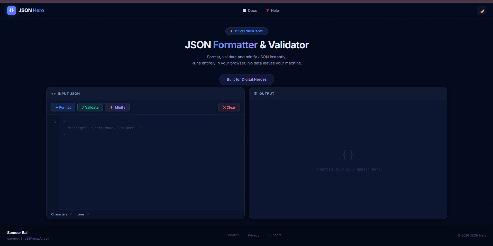

# 🚀 JSON Hero

A modern, browser-based **JSON Formatter & Validator** built with **React + Vite**.

JSON Hero allows developers to instantly **format**, **validate**, **minify**, **copy**, and **download** JSON data without sending anything to a server.

> ⚡ Fast  
> 🔒 Privacy Friendly  
> 🌙 Dark & Light Theme  
> 💻 Fully Responsive

---

## 🌐 Live Demo

**Live URL:** https://json-hero.vercel.app/

---

## 📌 About The Project

JSON is everywhere.

Whether you're:

- Testing REST APIs
- Working with frontend applications
- Building backend services
- Debugging API responses
- Preparing mock data

You often need to quickly:

- Check if JSON is valid
- Format unreadable JSON
- Remove spaces and indentation
- Copy clean JSON
- Save formatted JSON to a file

JSON Hero was built to make this process simple, fast and privacy-friendly.

All operations happen **entirely in the browser**.

- ✅ No server
- ✅ No API calls
- ✅ No data storage
- ✅ No tracking
- ✅ No data leaves your machine

---

## ✨ Features

### ✅ Format JSON

Pretty print JSON using proper indentation.

**Input**

```json
{"name":"Sameer","skills":["Java","React"]}
```

**Output**

```json
{
  "name": "Sameer",
  "skills": [
    "Java",
    "React"
  ]
}
```

---

### ✅ Validate JSON

Check whether JSON syntax is valid.

If invalid:

- Shows parsing error
- Prevents crashes
- Displays meaningful feedback

**Invalid Input**

```json
{
"name":"Sameer"
"age":20
}
```

**Output**

```text
Invalid JSON:
Expected ',' or '}' after property value
```

---

### ✅ Minify JSON

Remove unnecessary spaces and indentation.

**Input**

```json
{
  "name": "Sameer",
  "age": 20
}
```

**Output**

```json
{"name":"Sameer","age":20}
```

---

### ✅ Copy Output

Copy formatted or minified JSON to clipboard instantly.

---

### ✅ Download JSON

Download output as:

```text
formatted.json
```

---

### ✅ Dark / Light Theme

- Dark mode enabled by default
- Light mode available
- Theme preference saved using localStorage

---

### ✅ Privacy Friendly

JSON Hero runs entirely inside your browser.

✔ No server

✔ No API calls

✔ No data storage

✔ No tracking

✔ No data leaves your machine

---

## 🖥️ Screenshots

### Home Page





---

## 📁 Folder Structure

```text
json-hero/
│
├── public/
│
├── src/
│   ├── components/
│   │   ├── Navbar.jsx
│   │   ├── Footer.jsx
│   │   ├── EditorPanel.jsx
│   │   ├── OutputPanel.jsx
│   │   ├── ThemeToggle.jsx
│   │   ├── Modal.jsx
│   │   └── Toast.jsx
│   │
│   ├── hooks/
│   │
│   ├── utils/
│   │   ├── formatJson.js
│   │   ├── validateJson.js
│   │   ├── minifyJson.js
│   │   └── downloadJson.js
│   │
│   ├── App.jsx
│   ├── main.jsx
│   └── index.css
│
├── .gitignore
├── eslint.config.js
├── index.html
├── package.json
├── package-lock.json
├── README.md
└── vite.config.js
```

---

## 🛠️ Tech Stack

### Frontend

- React
- Vite
- JavaScript (ES6+)
- CSS

### Browser APIs

- Clipboard API
- localStorage API
- Blob API
- URL API

---

## ⚙️ Installation

Clone the repository:

```bash
git clone https://github.com/Sameer0Rai/json-hero.git
```

Move into the project:

```bash
cd json-hero
```

Install dependencies:

```bash
npm install
```

Run locally:

```bash
npm run dev
```

Build for production:

```bash
npm run build
```

Preview production build:

```bash
npm run preview
```

---

## 📱 Responsive Design

JSON Hero is fully responsive and optimized for:

- Desktop
- Laptop
- Tablet
- Mobile Devices

The editor panels automatically adapt to smaller screens for a smooth experience.

---

## 🧪 Edge Cases Handled

The application gracefully handles:

- Empty Input
- Invalid JSON
- Arrays
- Nested Objects
- Boolean Values
- Null Values
- Large JSON Objects

The application never crashes due to malformed input.

---

## 🎯 Built For Digital Heroes

This project was built as part of the **Custom Software Developer Trial Task** by Digital Heroes.

Requirements completed:

- ✅ Working online tool
- ✅ Real output generation
- ✅ Free deployment on Vercel
- ✅ Public GitHub repository
- ✅ Built for Digital Heroes button
- ✅ Full name and email displayed
- ✅ Added to personal portfolio
- ✅ ₹0 spent using only free tools

---

## 👨‍💻 Author

**Sameer Rai**

📧 sameer.0rai0@gmail.com

---

## 📄 License

This project is licensed under the MIT License.

---

### Built for Digital Heroes ❤️
